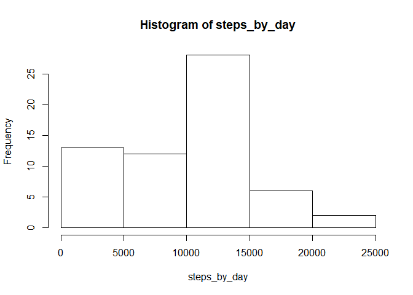
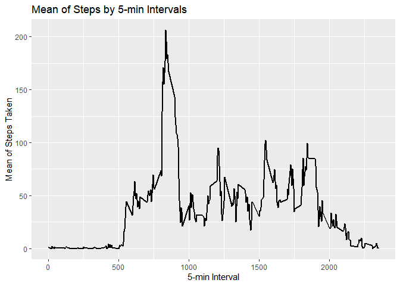
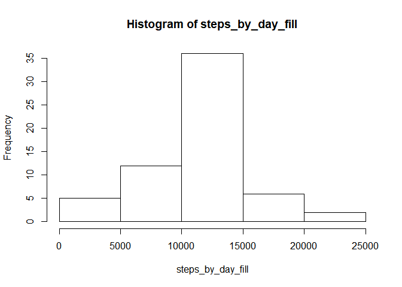
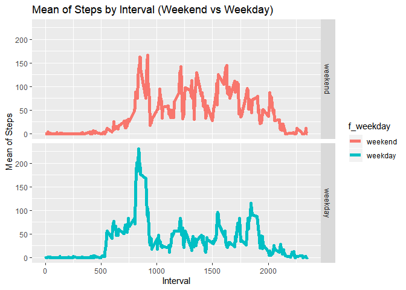

# Loading and preprocessing the data
## 1.Load the data (i.e. read.csv())

```r
library(ggplot2)

df <- read.csv("./activity/activity.csv", stringsAsFactors=FALSE, header=TRUE)
```
## 2.Process/transform the data (if necessary) into a format suitable for analysis

```r
# Fix the date column format
df$date <- as.Date(df$date)
```
# What is mean total number of steps taken per day?
# For this part of the assignment, we;ll ignore the missing values in the dataset.

## 1.Calculate the total number of steps taken per day

```r
steps_by_day <- tapply(df$steps, df$date, sum, na.rm=TRUE)
steps_by_day
```

```
## 2012-10-01 2012-10-02 2012-10-03 2012-10-04 2012-10-05 2012-10-06 
##          0        126      11352      12116      13294      15420 
## 2012-10-07 2012-10-08 2012-10-09 2012-10-10 2012-10-11 2012-10-12 
##      11015          0      12811       9900      10304      17382 
## 2012-10-13 2012-10-14 2012-10-15 2012-10-16 2012-10-17 2012-10-18 
##      12426      15098      10139      15084      13452      10056 
## 2012-10-19 2012-10-20 2012-10-21 2012-10-22 2012-10-23 2012-10-24 
##      11829      10395       8821      13460       8918       8355 
## 2012-10-25 2012-10-26 2012-10-27 2012-10-28 2012-10-29 2012-10-30 
##       2492       6778      10119      11458       5018       9819 
## 2012-10-31 2012-11-01 2012-11-02 2012-11-03 2012-11-04 2012-11-05 
##      15414          0      10600      10571          0      10439 
## 2012-11-06 2012-11-07 2012-11-08 2012-11-09 2012-11-10 2012-11-11 
##       8334      12883       3219          0          0      12608 
## 2012-11-12 2012-11-13 2012-11-14 2012-11-15 2012-11-16 2012-11-17 
##      10765       7336          0         41       5441      14339 
## 2012-11-18 2012-11-19 2012-11-20 2012-11-21 2012-11-22 2012-11-23 
##      15110       8841       4472      12787      20427      21194 
## 2012-11-24 2012-11-25 2012-11-26 2012-11-27 2012-11-28 2012-11-29 
##      14478      11834      11162      13646      10183       7047 
## 2012-11-30 
##          0
```
## 2.Make a histogram of the total number of steps taken each day

```r
hist(steps_by_day)
```

<!-- -->
## 3.Calculate and report the mean and median of the total number of steps taken per day

```r
mean(steps_by_day, na.rm=TRUE)
```

```
## [1] 9354.23
```

```r
median(steps_by_day, na.rm=TRUE)
```

```
## [1] 10395
```


# What is the average daily activity pattern?
## 1.Make a time series plot (i.e. type="l") of the 5-minute interval (x-axis) and the average number of steps taken, averaged across all days (y-axis)

```r
df_agg <- aggregate(steps ~ interval, df, mean, na.rm=TRUE)
df_agg
```

```
##     interval       steps
## 1          0   1.7169811
## 2          5   0.3396226
## 3         10   0.1320755
## 4         15   0.1509434
## 5         20   0.0754717
## 6         25   2.0943396
## 7         30   0.5283019
## 8         35   0.8679245
## 9         40   0.0000000
## 10        45   1.4716981
## 11        50   0.3018868
## 12        55   0.1320755
## 13       100   0.3207547
## 14       105   0.6792453
## 15       110   0.1509434
## 16       115   0.3396226
## 17       120   0.0000000
## 18       125   1.1132075
## 19       130   1.8301887
## 20       135   0.1698113
## 21       140   0.1698113
## 22       145   0.3773585
## 23       150   0.2641509
## 24       155   0.0000000
## 25       200   0.0000000
## 26       205   0.0000000
## 27       210   1.1320755
## 28       215   0.0000000
## 29       220   0.0000000
## 30       225   0.1320755
## 31       230   0.0000000
## 32       235   0.2264151
## 33       240   0.0000000
## 34       245   0.0000000
## 35       250   1.5471698
## 36       255   0.9433962
## 37       300   0.0000000
## 38       305   0.0000000
## 39       310   0.0000000
## 40       315   0.0000000
## 41       320   0.2075472
## 42       325   0.6226415
## 43       330   1.6226415
## 44       335   0.5849057
## 45       340   0.4905660
## 46       345   0.0754717
## 47       350   0.0000000
## 48       355   0.0000000
## 49       400   1.1886792
## 50       405   0.9433962
## 51       410   2.5660377
## 52       415   0.0000000
## 53       420   0.3396226
## 54       425   0.3584906
## 55       430   4.1132075
## 56       435   0.6603774
## 57       440   3.4905660
## 58       445   0.8301887
## 59       450   3.1132075
## 60       455   1.1132075
## 61       500   0.0000000
## 62       505   1.5660377
## 63       510   3.0000000
## 64       515   2.2452830
## 65       520   3.3207547
## 66       525   2.9622642
## 67       530   2.0943396
## 68       535   6.0566038
## 69       540  16.0188679
## 70       545  18.3396226
## 71       550  39.4528302
## 72       555  44.4905660
## 73       600  31.4905660
## 74       605  49.2641509
## 75       610  53.7735849
## 76       615  63.4528302
## 77       620  49.9622642
## 78       625  47.0754717
## 79       630  52.1509434
## 80       635  39.3396226
## 81       640  44.0188679
## 82       645  44.1698113
## 83       650  37.3584906
## 84       655  49.0377358
## 85       700  43.8113208
## 86       705  44.3773585
## 87       710  50.5094340
## 88       715  54.5094340
## 89       720  49.9245283
## 90       725  50.9811321
## 91       730  55.6792453
## 92       735  44.3207547
## 93       740  52.2641509
## 94       745  69.5471698
## 95       750  57.8490566
## 96       755  56.1509434
## 97       800  73.3773585
## 98       805  68.2075472
## 99       810 129.4339623
## 100      815 157.5283019
## 101      820 171.1509434
## 102      825 155.3962264
## 103      830 177.3018868
## 104      835 206.1698113
## 105      840 195.9245283
## 106      845 179.5660377
## 107      850 183.3962264
## 108      855 167.0188679
## 109      900 143.4528302
## 110      905 124.0377358
## 111      910 109.1132075
## 112      915 108.1132075
## 113      920 103.7169811
## 114      925  95.9622642
## 115      930  66.2075472
## 116      935  45.2264151
## 117      940  24.7924528
## 118      945  38.7547170
## 119      950  34.9811321
## 120      955  21.0566038
## 121     1000  40.5660377
## 122     1005  26.9811321
## 123     1010  42.4150943
## 124     1015  52.6603774
## 125     1020  38.9245283
## 126     1025  50.7924528
## 127     1030  44.2830189
## 128     1035  37.4150943
## 129     1040  34.6981132
## 130     1045  28.3396226
## 131     1050  25.0943396
## 132     1055  31.9433962
## 133     1100  31.3584906
## 134     1105  29.6792453
## 135     1110  21.3207547
## 136     1115  25.5471698
## 137     1120  28.3773585
## 138     1125  26.4716981
## 139     1130  33.4339623
## 140     1135  49.9811321
## 141     1140  42.0377358
## 142     1145  44.6037736
## 143     1150  46.0377358
## 144     1155  59.1886792
## 145     1200  63.8679245
## 146     1205  87.6981132
## 147     1210  94.8490566
## 148     1215  92.7735849
## 149     1220  63.3962264
## 150     1225  50.1698113
## 151     1230  54.4716981
## 152     1235  32.4150943
## 153     1240  26.5283019
## 154     1245  37.7358491
## 155     1250  45.0566038
## 156     1255  67.2830189
## 157     1300  42.3396226
## 158     1305  39.8867925
## 159     1310  43.2641509
## 160     1315  40.9811321
## 161     1320  46.2452830
## 162     1325  56.4339623
## 163     1330  42.7547170
## 164     1335  25.1320755
## 165     1340  39.9622642
## 166     1345  53.5471698
## 167     1350  47.3207547
## 168     1355  60.8113208
## 169     1400  55.7547170
## 170     1405  51.9622642
## 171     1410  43.5849057
## 172     1415  48.6981132
## 173     1420  35.4716981
## 174     1425  37.5471698
## 175     1430  41.8490566
## 176     1435  27.5094340
## 177     1440  17.1132075
## 178     1445  26.0754717
## 179     1450  43.6226415
## 180     1455  43.7735849
## 181     1500  30.0188679
## 182     1505  36.0754717
## 183     1510  35.4905660
## 184     1515  38.8490566
## 185     1520  45.9622642
## 186     1525  47.7547170
## 187     1530  48.1320755
## 188     1535  65.3207547
## 189     1540  82.9056604
## 190     1545  98.6603774
## 191     1550 102.1132075
## 192     1555  83.9622642
## 193     1600  62.1320755
## 194     1605  64.1320755
## 195     1610  74.5471698
## 196     1615  63.1698113
## 197     1620  56.9056604
## 198     1625  59.7735849
## 199     1630  43.8679245
## 200     1635  38.5660377
## 201     1640  44.6603774
## 202     1645  45.4528302
## 203     1650  46.2075472
## 204     1655  43.6792453
## 205     1700  46.6226415
## 206     1705  56.3018868
## 207     1710  50.7169811
## 208     1715  61.2264151
## 209     1720  72.7169811
## 210     1725  78.9433962
## 211     1730  68.9433962
## 212     1735  59.6603774
## 213     1740  75.0943396
## 214     1745  56.5094340
## 215     1750  34.7735849
## 216     1755  37.4528302
## 217     1800  40.6792453
## 218     1805  58.0188679
## 219     1810  74.6981132
## 220     1815  85.3207547
## 221     1820  59.2641509
## 222     1825  67.7735849
## 223     1830  77.6981132
## 224     1835  74.2452830
## 225     1840  85.3396226
## 226     1845  99.4528302
## 227     1850  86.5849057
## 228     1855  85.6037736
## 229     1900  84.8679245
## 230     1905  77.8301887
## 231     1910  58.0377358
## 232     1915  53.3584906
## 233     1920  36.3207547
## 234     1925  20.7169811
## 235     1930  27.3962264
## 236     1935  40.0188679
## 237     1940  30.2075472
## 238     1945  25.5471698
## 239     1950  45.6603774
## 240     1955  33.5283019
## 241     2000  19.6226415
## 242     2005  19.0188679
## 243     2010  19.3396226
## 244     2015  33.3396226
## 245     2020  26.8113208
## 246     2025  21.1698113
## 247     2030  27.3018868
## 248     2035  21.3396226
## 249     2040  19.5471698
## 250     2045  21.3207547
## 251     2050  32.3018868
## 252     2055  20.1509434
## 253     2100  15.9433962
## 254     2105  17.2264151
## 255     2110  23.4528302
## 256     2115  19.2452830
## 257     2120  12.4528302
## 258     2125   8.0188679
## 259     2130  14.6603774
## 260     2135  16.3018868
## 261     2140   8.6792453
## 262     2145   7.7924528
## 263     2150   8.1320755
## 264     2155   2.6226415
## 265     2200   1.4528302
## 266     2205   3.6792453
## 267     2210   4.8113208
## 268     2215   8.5094340
## 269     2220   7.0754717
## 270     2225   8.6981132
## 271     2230   9.7547170
## 272     2235   2.2075472
## 273     2240   0.3207547
## 274     2245   0.1132075
## 275     2250   1.6037736
## 276     2255   4.6037736
## 277     2300   3.3018868
## 278     2305   2.8490566
## 279     2310   0.0000000
## 280     2315   0.8301887
## 281     2320   0.9622642
## 282     2325   1.5849057
## 283     2330   2.6037736
## 284     2335   4.6981132
## 285     2340   3.3018868
## 286     2345   0.6415094
## 287     2350   0.2264151
## 288     2355   1.0754717
```

```r
chart <- ggplot(df_agg, aes(x=interval, y=steps))
chart <- chart + 
  geom_line(size = 1) +
  xlab("5-min Interval") +
  ylab("Mean of Steps Taken") +
  ggtitle("Mean of Steps by 5-min Intervals") + 
  theme(legend.position="right")
print(chart)
```

<!-- -->


## 2.Which 5-minute interval, on average across all the days in the dataset, contains the maximum number of steps?

```r
averages[which.max(df_agg$steps),]
```

```
##     interval    steps
## 104      835 206.1698
```

# Inputing missing values
Note that there are a number of days/intervals where there are missing values (coded as NA). The presence of missing days may introduce bias into some calculations or summaries of the data.

## 1. Calculate and report the total number of missing values in the dataset (i.e. the total number of rows with NAs)

```r
sum(!complete.cases(df))
```

```
## [1] 2304
```

## 2. Devise a strategy for filling in all of the missing values in the dataset. The strategy does not need to be sophisticated. For example, you could use the mean/median for that day, or the mean for that 5-minute interval, etc.

We'll take the mean of the interval and apply the value to NA values of "steps" column.

```r
df_avg_day <- aggregate(steps ~ interval, df, mean, na.rm=TRUE)

df_merge <- merge(df, df_avg_day, by="interval", all=TRUE)

df_merge$steps <- ifelse(is.na(df_merge$steps.x), df_merge$steps.y, df_merge$steps.x)

df_merge <- df_merge[ , !(names(df_merge) %in% c("steps.x","steps.y"))]

sum(!complete.cases(df_merge))
```

```
## [1] 0
```

```r
df_merge
```

```
##     interval       date      steps
## 1          0 2012-10-01  1.7169811
## 2          0 2012-11-23  0.0000000
## 3          0 2012-10-28  0.0000000
## 4          0 2012-11-06  0.0000000
## 5          0 2012-11-24  0.0000000
## 6          0 2012-11-15  0.0000000
## 7          0 2012-10-20  0.0000000
## 8          0 2012-11-16  0.0000000
## 9          0 2012-11-07  0.0000000
## 10         0 2012-11-25  0.0000000
## 11         0 2012-11-04  1.7169811
## 12         0 2012-11-08  0.0000000
## 13         0 2012-10-12  0.0000000
## 14         0 2012-10-30  0.0000000
## 15         0 2012-11-26  0.0000000
## 16         0 2012-10-04 47.0000000
## 17         0 2012-11-27  0.0000000
## 18         0 2012-10-31  0.0000000
## 19         0 2012-11-18  0.0000000
## 20         0 2012-10-05  0.0000000
## 21         0 2012-10-14  0.0000000
## 22         0 2012-10-23  0.0000000
## 23         0 2012-11-19  0.0000000
## 24         0 2012-10-11  0.0000000
## 25         0 2012-10-15  0.0000000
## 26         0 2012-10-06  0.0000000
## 27         0 2012-11-11  0.0000000
## 28         0 2012-11-29  0.0000000
## 29         0 2012-11-02  0.0000000
## 30         0 2012-10-07  0.0000000
## 31         0 2012-11-03  0.0000000
## 32         0 2012-11-30  1.7169811
## 33         0 2012-11-21  0.0000000
## 34         0 2012-10-02  0.0000000
## 35         0 2012-10-26  0.0000000
## 36         0 2012-11-22  0.0000000
## 37         0 2012-11-28  0.0000000
## 38         0 2012-11-13  0.0000000
## 39         0 2012-10-18  0.0000000
## 40         0 2012-10-27  0.0000000
## 41         0 2012-11-14  1.7169811
## 42         0 2012-10-22 10.0000000
## 43         0 2012-10-10 34.0000000
## 44         0 2012-10-19  0.0000000
## 45         0 2012-11-09  1.7169811
## 46         0 2012-10-17  0.0000000
## 47         0 2012-10-16  0.0000000
## 48         0 2012-10-29  0.0000000
## 49         0 2012-11-01  1.7169811
## 50         0 2012-10-21  0.0000000
## 51         0 2012-11-10  1.7169811
## 52         0 2012-10-03  0.0000000
## 53         0 2012-11-17  0.0000000
## 54         0 2012-11-12  0.0000000
## 55         0 2012-10-25  0.0000000
## 56         0 2012-10-13  0.0000000
## 57         0 2012-10-24  0.0000000
## 58         0 2012-10-08  1.7169811
## 59         0 2012-11-20  0.0000000
## 60         0 2012-11-05  0.0000000
## 61         0 2012-10-09  0.0000000
## 62         5 2012-10-13  0.0000000
## 63         5 2012-10-01  0.3396226
## 64         5 2012-11-18  0.0000000
## 65         5 2012-10-05  0.0000000
## 66         5 2012-11-29  0.0000000
## 67         5 2012-11-25  0.0000000
## 68         5 2012-11-04  0.3396226
## 69         5 2012-11-02  0.0000000
## 70         5 2012-11-23  0.0000000
## 71         5 2012-11-06  0.0000000
## 72         5 2012-10-21  0.0000000
## 73         5 2012-11-21  0.0000000
## 74         5 2012-11-15  0.0000000
## 75         5 2012-11-16  0.0000000
## 76         5 2012-11-30  0.3396226
## 77         5 2012-10-11  0.0000000
## 78         5 2012-11-13  0.0000000
## 79         5 2012-10-15  0.0000000
## 80         5 2012-11-19  0.0000000
## 81         5 2012-11-11  0.0000000
## 82         5 2012-11-14  0.3396226
## 83         5 2012-11-26  0.0000000
## 84         5 2012-10-28  0.0000000
## 85         5 2012-11-24  0.0000000
## 86         5 2012-11-09  0.3396226
## 87         5 2012-10-22  0.0000000
## 88         5 2012-10-16  0.0000000
## 89         5 2012-10-08  0.3396226
## 90         5 2012-11-28  0.0000000
## 91         5 2012-11-10  0.3396226
## 92         5 2012-10-23  0.0000000
## 93         5 2012-10-03  0.0000000
## 94         5 2012-10-27  0.0000000
## 95         5 2012-11-20  0.0000000
## 96         5 2012-10-06  0.0000000
## 97         5 2012-10-30  0.0000000
## 98         5 2012-10-31  0.0000000
## 99         5 2012-10-10 18.0000000
## 100        5 2012-11-03  0.0000000
## 101        5 2012-10-07  0.0000000
## 102        5 2012-10-29  0.0000000
## 103        5 2012-11-07  0.0000000
## 104        5 2012-11-22  0.0000000
## 105        5 2012-10-26  0.0000000
## 106        5 2012-10-24  0.0000000
## 107        5 2012-10-12  0.0000000
## 108        5 2012-11-05  0.0000000
## 109        5 2012-10-09  0.0000000
## 110        5 2012-11-08  0.0000000
## 111        5 2012-10-19  0.0000000
## 112        5 2012-10-04  0.0000000
## 113        5 2012-11-27  0.0000000
## 114        5 2012-11-12  0.0000000
## 115        5 2012-10-14  0.0000000
## 116        5 2012-10-17  0.0000000
## 117        5 2012-10-02  0.0000000
## 118        5 2012-11-01  0.3396226
## 119        5 2012-10-18  0.0000000
## 120        5 2012-11-17  0.0000000
## 121        5 2012-10-25  0.0000000
## 122        5 2012-10-20  0.0000000
## 123       10 2012-11-26  0.0000000
## 124       10 2012-11-15  0.0000000
## 125       10 2012-11-02  0.0000000
## 126       10 2012-11-25  0.0000000
## 127       10 2012-11-09  0.1320755
## 128       10 2012-10-01  0.1320755
## 129       10 2012-11-30  0.1320755
## 130       10 2012-11-07  0.0000000
## 131       10 2012-11-10  0.1320755
## 132       10 2012-11-04  0.1320755
## 133       10 2012-11-19  0.0000000
## 134       10 2012-10-12  0.0000000
## 135       10 2012-11-29  0.0000000
## 136       10 2012-10-27  0.0000000
## 137       10 2012-10-30  0.0000000
## 138       10 2012-11-06  0.0000000
## 139       10 2012-11-21  0.0000000
## 140       10 2012-11-03  0.0000000
## 141       10 2012-11-24  0.0000000
## 142       10 2012-11-18  0.0000000
## 143       10 2012-11-16  0.0000000
## 144       10 2012-11-22  0.0000000
## 145       10 2012-10-11  0.0000000
## 146       10 2012-11-01  0.1320755
## 147       10 2012-11-13  0.0000000
## 148       10 2012-11-11  0.0000000
## 149       10 2012-11-20  0.0000000
## 150       10 2012-10-06  0.0000000
## 151       10 2012-11-14  0.1320755
## 152       10 2012-10-28  0.0000000
## 153       10 2012-10-19  0.0000000
## 154       10 2012-10-22  0.0000000
## 155       10 2012-10-25  0.0000000
## 156       10 2012-10-05  0.0000000
## 157       10 2012-10-29  0.0000000
## 158       10 2012-10-23  0.0000000
## 159       10 2012-10-08  0.1320755
## 160       10 2012-11-28  0.0000000
## 161       10 2012-11-05  0.0000000
## 162       10 2012-10-18  0.0000000
## 163       10 2012-10-21  0.0000000
## 164       10 2012-10-04  0.0000000
## 165       10 2012-11-23  0.0000000
## 166       10 2012-10-31  0.0000000
## 167       10 2012-10-16  0.0000000
## 168       10 2012-10-14  0.0000000
## 169       10 2012-10-07  0.0000000
## 170       10 2012-10-20  0.0000000
## 171       10 2012-10-26  0.0000000
## 172       10 2012-10-09  0.0000000
## 173       10 2012-10-17  0.0000000
## 174       10 2012-11-17  0.0000000
## 175       10 2012-11-08  0.0000000
## 176       10 2012-11-27  0.0000000
## 177       10 2012-11-12  0.0000000
## 178       10 2012-10-24  0.0000000
## 179       10 2012-10-10  7.0000000
## 180       10 2012-10-02  0.0000000
## 181       10 2012-10-03  0.0000000
## 182       10 2012-10-15  0.0000000
## 183       10 2012-10-13  0.0000000
## 184       15 2012-10-30  0.0000000
## 185       15 2012-11-18  0.0000000
## 186       15 2012-10-12  0.0000000
## 187       15 2012-11-30  0.1509434
## 188       15 2012-11-28  0.0000000
## 189       15 2012-11-07  0.0000000
## 190       15 2012-11-19  0.0000000
## 191       15 2012-11-02  0.0000000
## 192       15 2012-11-11  0.0000000
## 193       15 2012-10-28  0.0000000
## 194       15 2012-11-20  0.0000000
## 195       15 2012-11-09  0.1509434
## 196       15 2012-11-21  0.0000000
## 197       15 2012-11-16  0.0000000
## 198       15 2012-11-03  0.0000000
## 199       15 2012-10-08  0.1509434
## 200       15 2012-11-22  0.0000000
## 201       15 2012-11-04  0.1509434
## 202       15 2012-10-26  0.0000000
## 203       15 2012-10-18  0.0000000
## 204       15 2012-10-27  0.0000000
## 205       15 2012-10-01  0.1509434
## 206       15 2012-11-23  0.0000000
## 207       15 2012-11-06  0.0000000
## 208       15 2012-10-16  0.0000000
## 209       15 2012-10-25  0.0000000
## 210       15 2012-10-22  0.0000000
## 211       15 2012-10-29  0.0000000
## 212       15 2012-10-02  0.0000000
## 213       15 2012-10-17  0.0000000
## 214       15 2012-10-11  8.0000000
## 215       15 2012-11-05  0.0000000
## 216       15 2012-11-08  0.0000000
## 217       15 2012-11-17  0.0000000
## 218       15 2012-10-21  0.0000000
## 219       15 2012-11-26  0.0000000
## 220       15 2012-10-31  0.0000000
## 221       15 2012-10-19  0.0000000
## 222       15 2012-10-04  0.0000000
## 223       15 2012-10-07  0.0000000
## 224       15 2012-10-20  0.0000000
## 225       15 2012-10-14  0.0000000
## 226       15 2012-10-05  0.0000000
## 227       15 2012-11-10  0.1509434
## 228       15 2012-10-15  0.0000000
## 229       15 2012-10-24  0.0000000
## 230       15 2012-10-09  0.0000000
## 231       15 2012-10-06  0.0000000
## 232       15 2012-11-29  0.0000000
## 233       15 2012-10-10  0.0000000
## 234       15 2012-11-27  0.0000000
## 235       15 2012-11-12  0.0000000
## 236       15 2012-10-03  0.0000000
## 237       15 2012-11-24  0.0000000
## 238       15 2012-11-15  0.0000000
## 239       15 2012-10-13  0.0000000
## 240       15 2012-11-01  0.1509434
## 241       15 2012-10-23  0.0000000
## 242       15 2012-11-13  0.0000000
## 243       15 2012-11-25  0.0000000
## 244       15 2012-11-14  0.1509434
## 245       20 2012-11-21  0.0000000
## 246       20 2012-11-05  0.0000000
## 247       20 2012-10-29  0.0000000
## 248       20 2012-10-08  0.0754717
## 249       20 2012-11-12  0.0000000
## 250       20 2012-11-03  0.0000000
## 251       20 2012-10-15  0.0000000
## 252       20 2012-10-19  0.0000000
## 253       20 2012-10-02  0.0000000
## 254       20 2012-11-22  0.0000000
## 255       20 2012-11-16  0.0000000
## 256       20 2012-10-14  0.0000000
## 257       20 2012-10-09  0.0000000
## 258       20 2012-11-17  0.0000000
## 259       20 2012-10-12  0.0000000
## 260       20 2012-11-25  0.0000000
## 261       20 2012-11-27  0.0000000
## 262       20 2012-10-28  0.0000000
## 263       20 2012-10-31  0.0000000
## 264       20 2012-10-01  0.0754717
## 265       20 2012-10-20  0.0000000
## 266       20 2012-10-05  0.0000000
## 267       20 2012-11-07  0.0000000
## 268       20 2012-11-09  0.0754717
## 269       20 2012-11-19  0.0000000
## 270       20 2012-10-24  0.0000000
## 271       20 2012-11-10  0.0754717
## 272       20 2012-10-06  0.0000000
## 273       20 2012-11-11  0.0000000
## 274       20 2012-11-23  0.0000000
## 275       20 2012-10-04  0.0000000
## 276       20 2012-10-07  0.0000000
## 277       20 2012-10-16  0.0000000
## 278       20 2012-11-30  0.0754717
## 279       20 2012-11-15  0.0000000
## 280       20 2012-11-26  0.0000000
## 281       20 2012-10-23  4.0000000
## 282       20 2012-11-04  0.0754717
## 283       20 2012-11-13  0.0000000
## 284       20 2012-11-18  0.0000000
## 285       20 2012-10-18  0.0000000
## 286       20 2012-10-27  0.0000000
## 287       20 2012-11-14  0.0754717
## 288       20 2012-11-28  0.0000000
## 289       20 2012-10-10  0.0000000
## 290       20 2012-11-06  0.0000000
## 291       20 2012-11-24  0.0000000
## 292       20 2012-10-30  0.0000000
## 293       20 2012-11-29  0.0000000
## 294       20 2012-10-26  0.0000000
## 295       20 2012-10-11  0.0000000
## 296       20 2012-10-22  0.0000000
## 297       20 2012-11-20  0.0000000
## 298       20 2012-11-08  0.0000000
## 299       20 2012-10-21  0.0000000
## 300       20 2012-11-01  0.0754717
## 301       20 2012-10-25  0.0000000
## 302       20 2012-10-13  0.0000000
## 303       20 2012-10-03  0.0000000
## 304       20 2012-10-17  0.0000000
## 305       20 2012-11-02  0.0000000
## 306       25 2012-10-04  0.0000000
## 307       25 2012-10-02  0.0000000
## 308       25 2012-11-03  0.0000000
## 309       25 2012-11-15  0.0000000
## 310       25 2012-11-18  0.0000000
## 311       25 2012-10-23  0.0000000
## 312       25 2012-10-24  0.0000000
## 313       25 2012-10-08  2.0943396
## 314       25 2012-11-25  0.0000000
## 315       25 2012-11-29  0.0000000
## 316       25 2012-11-02  0.0000000
## 317       25 2012-11-30  2.0943396
## 318       25 2012-10-16  0.0000000
## 319       25 2012-11-21  0.0000000
## 320       25 2012-10-07  0.0000000
## 321       25 2012-10-20  0.0000000
## 322       25 2012-10-26  0.0000000
## 323       25 2012-11-19  0.0000000
## 324       25 2012-11-13  0.0000000
## 325       25 2012-10-15 35.0000000
## 326       25 2012-11-05  0.0000000
## 327       25 2012-10-01  2.0943396
## 328       25 2012-11-14  2.0943396
## 329       25 2012-11-23  0.0000000
## 330       25 2012-10-13  0.0000000
## 331       25 2012-11-06  0.0000000
## 332       25 2012-11-24  0.0000000
## 333       25 2012-10-28  0.0000000
##  [ reached 'max' / getOption("max.print") -- omitted 17235 rows ]
```

## 3. Create a new dataset that is equal to the original dataset but with the missing data filled in.

```r
df_merge
```

```
##     interval       date      steps
## 1          0 2012-10-01  1.7169811
## 2          0 2012-11-23  0.0000000
## 3          0 2012-10-28  0.0000000
## 4          0 2012-11-06  0.0000000
## 5          0 2012-11-24  0.0000000
## 6          0 2012-11-15  0.0000000
## 7          0 2012-10-20  0.0000000
## 8          0 2012-11-16  0.0000000
## 9          0 2012-11-07  0.0000000
## 10         0 2012-11-25  0.0000000
## 11         0 2012-11-04  1.7169811
## 12         0 2012-11-08  0.0000000
## 13         0 2012-10-12  0.0000000
## 14         0 2012-10-30  0.0000000
## 15         0 2012-11-26  0.0000000
## 16         0 2012-10-04 47.0000000
## 17         0 2012-11-27  0.0000000
## 18         0 2012-10-31  0.0000000
## 19         0 2012-11-18  0.0000000
## 20         0 2012-10-05  0.0000000
## 21         0 2012-10-14  0.0000000
## 22         0 2012-10-23  0.0000000
## 23         0 2012-11-19  0.0000000
## 24         0 2012-10-11  0.0000000
## 25         0 2012-10-15  0.0000000
## 26         0 2012-10-06  0.0000000
## 27         0 2012-11-11  0.0000000
## 28         0 2012-11-29  0.0000000
## 29         0 2012-11-02  0.0000000
## 30         0 2012-10-07  0.0000000
## 31         0 2012-11-03  0.0000000
## 32         0 2012-11-30  1.7169811
## 33         0 2012-11-21  0.0000000
## 34         0 2012-10-02  0.0000000
## 35         0 2012-10-26  0.0000000
## 36         0 2012-11-22  0.0000000
## 37         0 2012-11-28  0.0000000
## 38         0 2012-11-13  0.0000000
## 39         0 2012-10-18  0.0000000
## 40         0 2012-10-27  0.0000000
## 41         0 2012-11-14  1.7169811
## 42         0 2012-10-22 10.0000000
## 43         0 2012-10-10 34.0000000
## 44         0 2012-10-19  0.0000000
## 45         0 2012-11-09  1.7169811
## 46         0 2012-10-17  0.0000000
## 47         0 2012-10-16  0.0000000
## 48         0 2012-10-29  0.0000000
## 49         0 2012-11-01  1.7169811
## 50         0 2012-10-21  0.0000000
## 51         0 2012-11-10  1.7169811
## 52         0 2012-10-03  0.0000000
## 53         0 2012-11-17  0.0000000
## 54         0 2012-11-12  0.0000000
## 55         0 2012-10-25  0.0000000
## 56         0 2012-10-13  0.0000000
## 57         0 2012-10-24  0.0000000
## 58         0 2012-10-08  1.7169811
## 59         0 2012-11-20  0.0000000
## 60         0 2012-11-05  0.0000000
## 61         0 2012-10-09  0.0000000
## 62         5 2012-10-13  0.0000000
## 63         5 2012-10-01  0.3396226
## 64         5 2012-11-18  0.0000000
## 65         5 2012-10-05  0.0000000
## 66         5 2012-11-29  0.0000000
## 67         5 2012-11-25  0.0000000
## 68         5 2012-11-04  0.3396226
## 69         5 2012-11-02  0.0000000
## 70         5 2012-11-23  0.0000000
## 71         5 2012-11-06  0.0000000
## 72         5 2012-10-21  0.0000000
## 73         5 2012-11-21  0.0000000
## 74         5 2012-11-15  0.0000000
## 75         5 2012-11-16  0.0000000
## 76         5 2012-11-30  0.3396226
## 77         5 2012-10-11  0.0000000
## 78         5 2012-11-13  0.0000000
## 79         5 2012-10-15  0.0000000
## 80         5 2012-11-19  0.0000000
## 81         5 2012-11-11  0.0000000
## 82         5 2012-11-14  0.3396226
## 83         5 2012-11-26  0.0000000
## 84         5 2012-10-28  0.0000000
## 85         5 2012-11-24  0.0000000
## 86         5 2012-11-09  0.3396226
## 87         5 2012-10-22  0.0000000
## 88         5 2012-10-16  0.0000000
## 89         5 2012-10-08  0.3396226
## 90         5 2012-11-28  0.0000000
## 91         5 2012-11-10  0.3396226
## 92         5 2012-10-23  0.0000000
## 93         5 2012-10-03  0.0000000
## 94         5 2012-10-27  0.0000000
## 95         5 2012-11-20  0.0000000
## 96         5 2012-10-06  0.0000000
## 97         5 2012-10-30  0.0000000
## 98         5 2012-10-31  0.0000000
## 99         5 2012-10-10 18.0000000
## 100        5 2012-11-03  0.0000000
## 101        5 2012-10-07  0.0000000
## 102        5 2012-10-29  0.0000000
## 103        5 2012-11-07  0.0000000
## 104        5 2012-11-22  0.0000000
## 105        5 2012-10-26  0.0000000
## 106        5 2012-10-24  0.0000000
## 107        5 2012-10-12  0.0000000
## 108        5 2012-11-05  0.0000000
## 109        5 2012-10-09  0.0000000
## 110        5 2012-11-08  0.0000000
## 111        5 2012-10-19  0.0000000
## 112        5 2012-10-04  0.0000000
## 113        5 2012-11-27  0.0000000
## 114        5 2012-11-12  0.0000000
## 115        5 2012-10-14  0.0000000
## 116        5 2012-10-17  0.0000000
## 117        5 2012-10-02  0.0000000
## 118        5 2012-11-01  0.3396226
## 119        5 2012-10-18  0.0000000
## 120        5 2012-11-17  0.0000000
## 121        5 2012-10-25  0.0000000
## 122        5 2012-10-20  0.0000000
## 123       10 2012-11-26  0.0000000
## 124       10 2012-11-15  0.0000000
## 125       10 2012-11-02  0.0000000
## 126       10 2012-11-25  0.0000000
## 127       10 2012-11-09  0.1320755
## 128       10 2012-10-01  0.1320755
## 129       10 2012-11-30  0.1320755
## 130       10 2012-11-07  0.0000000
## 131       10 2012-11-10  0.1320755
## 132       10 2012-11-04  0.1320755
## 133       10 2012-11-19  0.0000000
## 134       10 2012-10-12  0.0000000
## 135       10 2012-11-29  0.0000000
## 136       10 2012-10-27  0.0000000
## 137       10 2012-10-30  0.0000000
## 138       10 2012-11-06  0.0000000
## 139       10 2012-11-21  0.0000000
## 140       10 2012-11-03  0.0000000
## 141       10 2012-11-24  0.0000000
## 142       10 2012-11-18  0.0000000
## 143       10 2012-11-16  0.0000000
## 144       10 2012-11-22  0.0000000
## 145       10 2012-10-11  0.0000000
## 146       10 2012-11-01  0.1320755
## 147       10 2012-11-13  0.0000000
## 148       10 2012-11-11  0.0000000
## 149       10 2012-11-20  0.0000000
## 150       10 2012-10-06  0.0000000
## 151       10 2012-11-14  0.1320755
## 152       10 2012-10-28  0.0000000
## 153       10 2012-10-19  0.0000000
## 154       10 2012-10-22  0.0000000
## 155       10 2012-10-25  0.0000000
## 156       10 2012-10-05  0.0000000
## 157       10 2012-10-29  0.0000000
## 158       10 2012-10-23  0.0000000
## 159       10 2012-10-08  0.1320755
## 160       10 2012-11-28  0.0000000
## 161       10 2012-11-05  0.0000000
## 162       10 2012-10-18  0.0000000
## 163       10 2012-10-21  0.0000000
## 164       10 2012-10-04  0.0000000
## 165       10 2012-11-23  0.0000000
## 166       10 2012-10-31  0.0000000
## 167       10 2012-10-16  0.0000000
## 168       10 2012-10-14  0.0000000
## 169       10 2012-10-07  0.0000000
## 170       10 2012-10-20  0.0000000
## 171       10 2012-10-26  0.0000000
## 172       10 2012-10-09  0.0000000
## 173       10 2012-10-17  0.0000000
## 174       10 2012-11-17  0.0000000
## 175       10 2012-11-08  0.0000000
## 176       10 2012-11-27  0.0000000
## 177       10 2012-11-12  0.0000000
## 178       10 2012-10-24  0.0000000
## 179       10 2012-10-10  7.0000000
## 180       10 2012-10-02  0.0000000
## 181       10 2012-10-03  0.0000000
## 182       10 2012-10-15  0.0000000
## 183       10 2012-10-13  0.0000000
## 184       15 2012-10-30  0.0000000
## 185       15 2012-11-18  0.0000000
## 186       15 2012-10-12  0.0000000
## 187       15 2012-11-30  0.1509434
## 188       15 2012-11-28  0.0000000
## 189       15 2012-11-07  0.0000000
## 190       15 2012-11-19  0.0000000
## 191       15 2012-11-02  0.0000000
## 192       15 2012-11-11  0.0000000
## 193       15 2012-10-28  0.0000000
## 194       15 2012-11-20  0.0000000
## 195       15 2012-11-09  0.1509434
## 196       15 2012-11-21  0.0000000
## 197       15 2012-11-16  0.0000000
## 198       15 2012-11-03  0.0000000
## 199       15 2012-10-08  0.1509434
## 200       15 2012-11-22  0.0000000
## 201       15 2012-11-04  0.1509434
## 202       15 2012-10-26  0.0000000
## 203       15 2012-10-18  0.0000000
## 204       15 2012-10-27  0.0000000
## 205       15 2012-10-01  0.1509434
## 206       15 2012-11-23  0.0000000
## 207       15 2012-11-06  0.0000000
## 208       15 2012-10-16  0.0000000
## 209       15 2012-10-25  0.0000000
## 210       15 2012-10-22  0.0000000
## 211       15 2012-10-29  0.0000000
## 212       15 2012-10-02  0.0000000
## 213       15 2012-10-17  0.0000000
## 214       15 2012-10-11  8.0000000
## 215       15 2012-11-05  0.0000000
## 216       15 2012-11-08  0.0000000
## 217       15 2012-11-17  0.0000000
## 218       15 2012-10-21  0.0000000
## 219       15 2012-11-26  0.0000000
## 220       15 2012-10-31  0.0000000
## 221       15 2012-10-19  0.0000000
## 222       15 2012-10-04  0.0000000
## 223       15 2012-10-07  0.0000000
## 224       15 2012-10-20  0.0000000
## 225       15 2012-10-14  0.0000000
## 226       15 2012-10-05  0.0000000
## 227       15 2012-11-10  0.1509434
## 228       15 2012-10-15  0.0000000
## 229       15 2012-10-24  0.0000000
## 230       15 2012-10-09  0.0000000
## 231       15 2012-10-06  0.0000000
## 232       15 2012-11-29  0.0000000
## 233       15 2012-10-10  0.0000000
## 234       15 2012-11-27  0.0000000
## 235       15 2012-11-12  0.0000000
## 236       15 2012-10-03  0.0000000
## 237       15 2012-11-24  0.0000000
## 238       15 2012-11-15  0.0000000
## 239       15 2012-10-13  0.0000000
## 240       15 2012-11-01  0.1509434
## 241       15 2012-10-23  0.0000000
## 242       15 2012-11-13  0.0000000
## 243       15 2012-11-25  0.0000000
## 244       15 2012-11-14  0.1509434
## 245       20 2012-11-21  0.0000000
## 246       20 2012-11-05  0.0000000
## 247       20 2012-10-29  0.0000000
## 248       20 2012-10-08  0.0754717
## 249       20 2012-11-12  0.0000000
## 250       20 2012-11-03  0.0000000
## 251       20 2012-10-15  0.0000000
## 252       20 2012-10-19  0.0000000
## 253       20 2012-10-02  0.0000000
## 254       20 2012-11-22  0.0000000
## 255       20 2012-11-16  0.0000000
## 256       20 2012-10-14  0.0000000
## 257       20 2012-10-09  0.0000000
## 258       20 2012-11-17  0.0000000
## 259       20 2012-10-12  0.0000000
## 260       20 2012-11-25  0.0000000
## 261       20 2012-11-27  0.0000000
## 262       20 2012-10-28  0.0000000
## 263       20 2012-10-31  0.0000000
## 264       20 2012-10-01  0.0754717
## 265       20 2012-10-20  0.0000000
## 266       20 2012-10-05  0.0000000
## 267       20 2012-11-07  0.0000000
## 268       20 2012-11-09  0.0754717
## 269       20 2012-11-19  0.0000000
## 270       20 2012-10-24  0.0000000
## 271       20 2012-11-10  0.0754717
## 272       20 2012-10-06  0.0000000
## 273       20 2012-11-11  0.0000000
## 274       20 2012-11-23  0.0000000
## 275       20 2012-10-04  0.0000000
## 276       20 2012-10-07  0.0000000
## 277       20 2012-10-16  0.0000000
## 278       20 2012-11-30  0.0754717
## 279       20 2012-11-15  0.0000000
## 280       20 2012-11-26  0.0000000
## 281       20 2012-10-23  4.0000000
## 282       20 2012-11-04  0.0754717
## 283       20 2012-11-13  0.0000000
## 284       20 2012-11-18  0.0000000
## 285       20 2012-10-18  0.0000000
## 286       20 2012-10-27  0.0000000
## 287       20 2012-11-14  0.0754717
## 288       20 2012-11-28  0.0000000
## 289       20 2012-10-10  0.0000000
## 290       20 2012-11-06  0.0000000
## 291       20 2012-11-24  0.0000000
## 292       20 2012-10-30  0.0000000
## 293       20 2012-11-29  0.0000000
## 294       20 2012-10-26  0.0000000
## 295       20 2012-10-11  0.0000000
## 296       20 2012-10-22  0.0000000
## 297       20 2012-11-20  0.0000000
## 298       20 2012-11-08  0.0000000
## 299       20 2012-10-21  0.0000000
## 300       20 2012-11-01  0.0754717
## 301       20 2012-10-25  0.0000000
## 302       20 2012-10-13  0.0000000
## 303       20 2012-10-03  0.0000000
## 304       20 2012-10-17  0.0000000
## 305       20 2012-11-02  0.0000000
## 306       25 2012-10-04  0.0000000
## 307       25 2012-10-02  0.0000000
## 308       25 2012-11-03  0.0000000
## 309       25 2012-11-15  0.0000000
## 310       25 2012-11-18  0.0000000
## 311       25 2012-10-23  0.0000000
## 312       25 2012-10-24  0.0000000
## 313       25 2012-10-08  2.0943396
## 314       25 2012-11-25  0.0000000
## 315       25 2012-11-29  0.0000000
## 316       25 2012-11-02  0.0000000
## 317       25 2012-11-30  2.0943396
## 318       25 2012-10-16  0.0000000
## 319       25 2012-11-21  0.0000000
## 320       25 2012-10-07  0.0000000
## 321       25 2012-10-20  0.0000000
## 322       25 2012-10-26  0.0000000
## 323       25 2012-11-19  0.0000000
## 324       25 2012-11-13  0.0000000
## 325       25 2012-10-15 35.0000000
## 326       25 2012-11-05  0.0000000
## 327       25 2012-10-01  2.0943396
## 328       25 2012-11-14  2.0943396
## 329       25 2012-11-23  0.0000000
## 330       25 2012-10-13  0.0000000
## 331       25 2012-11-06  0.0000000
## 332       25 2012-11-24  0.0000000
## 333       25 2012-10-28  0.0000000
##  [ reached 'max' / getOption("max.print") -- omitted 17235 rows ]
```

## 4. Make a histogram of the total number of steps taken each day and Calculate and report the mean and median total number of steps taken per day. Do these values differ from the estimates from the first part of the assignment? What is the impact of imputing missing data on the estimates of the total daily number of steps?

```r
# With NA values
hist(steps_by_day)
```

<!-- -->

```r
mean(steps_by_day, na.rm=TRUE)
```

```
## [1] 9354.23
```

```r
median(steps_by_day, na.rm=TRUE)
```

```
## [1] 10395
```

```r
# With NA values filled in
steps_by_day_fill <- tapply(df_merge$steps, df_merge$date, sum)
hist(steps_by_day_fill)
```

<!-- -->

```r
mean(steps_by_day_fill)
```

```
## [1] 10766.19
```

```r
median(steps_by_day_fill)
```

```
## [1] 10766.19
```
Mean and median values are higher after filling in missing data. This behavior is understable upon viewing the distribution of the original data. NA values (which interpreted as 0) causes the distribution to skew to the left of mean.  

However, after replacing NA `steps` values with the mean `steps`
of each day, those 0 values are effectively removed from the histogram. Thus, the mean and median shift further to the right (higher value),

# Are there differences in activity patterns between weekdays and weekends?
For this part the weekdays() function may be of some help here. Use the dataset with the filled-in missing values for this part.

## 1.Create a new factor variable in the dataset with two levels – “weekday” and “weekend” indicating whether a given date is a weekday or weekend day.

```r
c_weekdays <- c('Monday', 'Tuesday', 'Wednesday', 'Thursday', 'Friday')

df_merge$f_weekday <- factor((weekdays(df_merge$date) %in% c_weekdays), 
  levels=c(FALSE, TRUE), labels=c('weekend', 'weekday')  )
```

## 2.Make a panel plot containing a time series plot (i.e. type="l") of the 5-minute interval (x-axis) and the average number of steps taken, averaged across all weekday days or weekend days (y-axis). See the README file in the GitHub repository to see an example of what this plot should look like using simulated data.

```r
df_merge_agg <- aggregate(steps ~ f_weekday + interval, df_merge, mean)

chart <- ggplot(df_merge_agg, aes(x=interval, y=steps, color=f_weekday))
chart <- chart + 
  geom_line(size = 2) +
  facet_grid(f_weekday ~.) +
  xlab("Interval") +
  ylab("Mean of Steps") +
  ggtitle("Mean of Steps by Interval (Weekend vs Weekday)") + 
  theme(legend.position="right")

print(chart)
```

<!-- -->
